# Technical Report: Rho Studio UI
An Android Jetpack Compose app.

> _Document Version: 3.0 Last Updated: August 24, 2026_
## Enterprise-Grade Android Architecture with Jetpack Compose

This document provides a comprehensive technical overview of the **Rho Studio UI** application. It serves as the primary architectural reference for developers, outlining the system's design, layer responsibilities, and technical standards.

---

## 1. Executive Summary
Rho Studio UI is the **base application template** designed to establish and enforce the **Rho Studio Android App Standards**. It provides a robust foundation for building secure, authenticated mobile experiences within the Rho Studio ecosystem.

The application is a **Jetpack Compose** implementation following a **Single-Activity Architecture**, leveraging a reactive **MVVM (Model-View-ViewModel)** pattern, implementing a Multi-Tier Dagger Hierarchy and a fluid user experience driven by **Unidirectional Data Flow (UDF)**. This architectural foundation ensures a focus on **Fluid UX**, **Transactional Integrity**, and **Decoupled Business Logic**.

**Contribution**: [See CONTRIBUTION.md](./CONTRIBUTION.md).

### Core Features:
- **Authentication Orchestration**: Implements a production flow using Firebase Auth with a reactive session lifecycle. It ensures transactional security by synchronizing remote authentication states with automated, state-driven navigation transitions.
- **Architectural Boundaries**: A high-performance Multi-Tier Dagger Hierarchy that enforces strict data isolation between core, app, and user scopes. Sensitive user information is isolated within a dedicated "User Tier" that is physically purged from memory upon logout to prevent data leakage.
- **Reactive Data Layer and State Integrity**: Leverages Jetpack DataStore for atomic persistence and a Sealed State Machine for global orchestration. This creates a thread-safe, non-blocking "stream of truth" that guarantees the UI remains a perfect reflection of the underlying data.
- **Stateless Presentation Layer**: A fully decoupled UI built with Jetpack Compose following Unidirectional Data Flow (UDF) principles. This enables the presentation layer to scale dynamically across diverse device form factors while ensuring high testability and visual consistency.
- **Domain-Driven Design (DDD)**: Every business operation is encapsulated in a dedicated UseCase (Interactor) within a framework-independent domain layer. By strictly isolating the business rules from the Android framework, ensure testability, logic reusability, and architectural resilience against framework changes.

---

## 2. Architectural Framework
The application follows a **Single-Activity Architecture** and is structured according to **Clean Architecture** principles. It utilizes a **Feature-Layered Modularization** strategy to ensure scalability and maintainability.

### 2.1 Layered Structure
The system follows the three layers Google's recommendations:

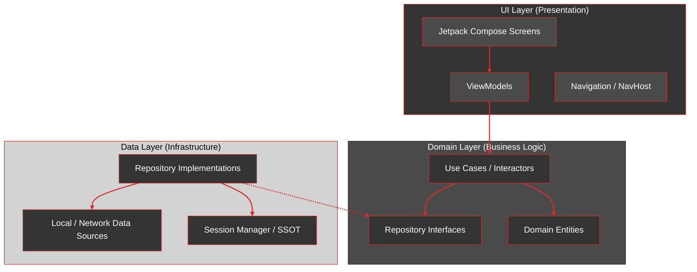

### 2.2 Multi-Module Topology
The project is split into granular Gradle modules to improve build parallelization and enforce boundaries.
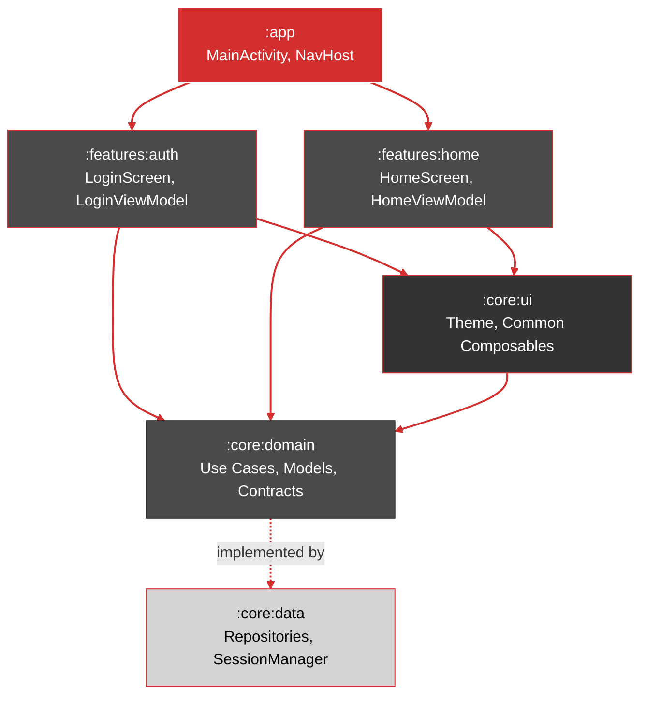
> **Key Principle**: `:features` depend only on `:core` modules (`:core:domain`, `:core:ui`), preventing circular dependencies. Feature-specific models remain within their respective feature modules.

### 2.3 Multi-Tier Dependency Injection (Dagger 2 + KSP)
We utilize a high-performance Directed Acyclic Graph (DAG) generated at compile-time using KSP to ensure zero runtime overhead. The graph is organized into three tiers to mirror the application lifecycle:

#### DI Conceptual Framework

| Concept | Implementation | Purpose |
| :--- | :--- | :--- |
| **The Request** | `@Inject` constructor | Objects request dependencies via constructor injection, ensuring loose coupling and testability |
| **The Recipe** | `@Module` with `@Provides` / `@Binds` | Dagger Modules define how to provide complex objects, interfaces, or library classes |
| **The Manager** | `@Component` | Bridge between providers (Modules) and consumers (Activities/ViewModels). Validates graph at compile-time |
| **The Lifecycle** | `@Scope` (e.g., `@Singleton`, `@UserScope`) | Ensures objects live exactly as long as their context (App lifecycle vs. User session) |
| **Annotation Retention** | `@Retention(AnnotationRetention.RUNTIME)` | Ensures annotation metadata is available to Dagger compiler and at runtime |
| **Multibinding Keys** | `@MapKey` | Identifies which class type to use as a Key in Dagger's internal Maps |
| **Lazy Provisioning** | `Provider<T>` | Defers actual creation of dependencies until requested, saving memory and startup time |
| **Kotlin Interop** | `@JvmSuppressWildcards` | Handles Kotlin's generic covariance in Dagger's Java-based compiler |

#### Multi-Tier Component Dependency Architecture

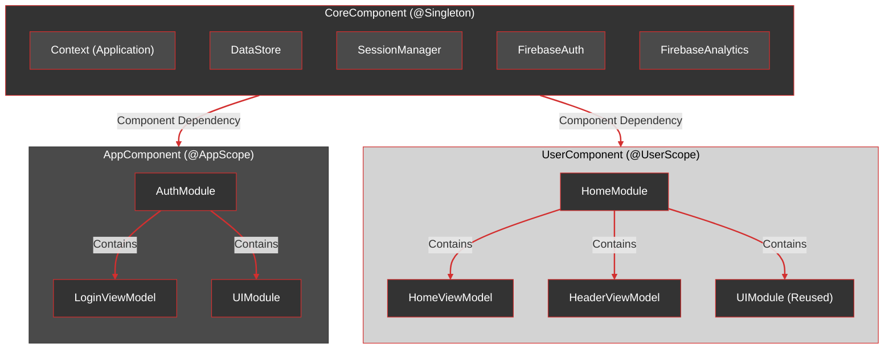

**Core Tier** (`CoreComponent`):

- **Scope**: `@Singleton`.
- **Responsibility**: Infrastructure foundation (Firebase, DataStore, Threading).
- **Hierarchy**: The foundation; does not depend on other components.

**App Tier** (`AppComponent`):

- **Scope**: @AppScope.
- **Responsibility**: Public lifecycle (Authentication feature, Shared UI).
- **Hierarchy**: Depends on CoreComponent. Orchestrates AuthModule (Pre-Login ViewModels) and UIModule (Shared ViewModels).

**User Tier** (`UserComponent`):

- **Scope**: `@UserScope`.
- **Responsibility**: Authenticated session (Home feature, Profile).
- **Hierarchy**: Depends on CoreComponent. Orchestrates `HomeModule` (Post-Login ViewModels) and `UIModule`.
- **Isolation**: Created dynamically upon login and binary-purged from memory upon logout to ensure session security.

### 2.4 ViewModel Multibinding Strategy

To decouple the UI from DI wiring, we implement a centralized registry using `@IntoMap`:

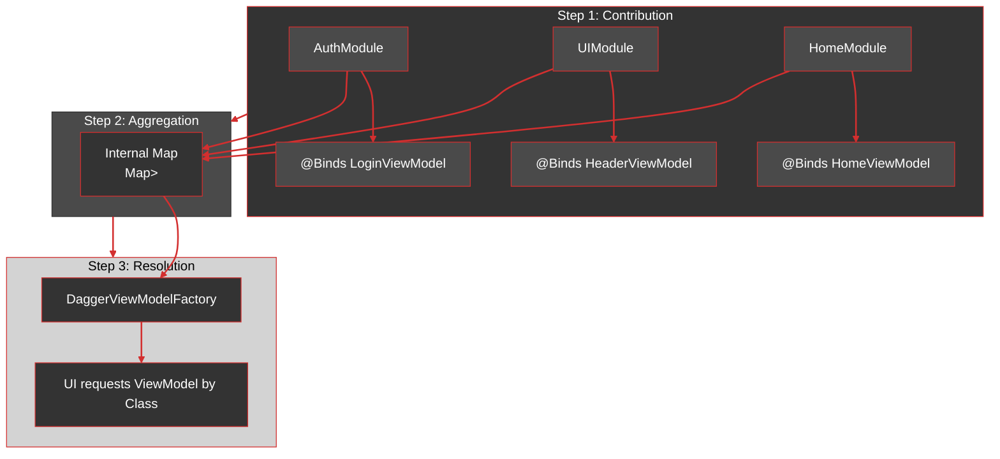

#### Key Principles:

- **Registry**: Feature modules contribute ViewModels via a custom @ViewModelKey.
- **Factory**: A single DaggerViewModelFactory resolves instances on-demand, adhering to the Open/Closed Principle.
- **Isolation**: Each component builds unique internal Maps, ensuring strict data and logic isolation based on user state.

| Component | Modules Included | Resulting Internal Map |
| :--- | :--- | :--- |
| **AppComponent** | `AuthModule`, `UIModule` | `{LoginViewModel, HeaderViewModel}` |
| **UserComponent** | `HomeModule`, `UIModule` | `{HomeViewModel, HeaderViewModel}` |

---

## 3. Layer Detail & Responsibilities

### 3.1 UI Layer (Presentation)
**Goal**: Transform application state into a visual interface and handle user interactions.
- **Jetpack Compose**: All UI is declarative, using stateless composables for maximum testability.
- **MVVM Pattern**: ViewModels manage UI state using `StateFlow`, exposing it to the UI in a lifecycle-aware manner.
- **UDF (Unidirectional Data Flow)**: User actions trigger events in the ViewModel, which updates the state, triggering a UI recomposition.
- **Side-Effect Orchestration**: `MainActivity` uses `LaunchedEffect` keyed to authentication state, transforming state changes into one-time navigation events.
- **Key Components**:
    - `MainActivity.kt`: The entry point and navigation orchestrator.
    - `LoginViewModel.kt` & `HomeViewModel.kt`: Feature-specific state holders.
    - `BaseViewModel.kt`: Provides shared logic for loading states, error handling, and navigation side-effects.
    - `HeaderViewModel.kt`: Bridges `SessionManager` state to common UI components
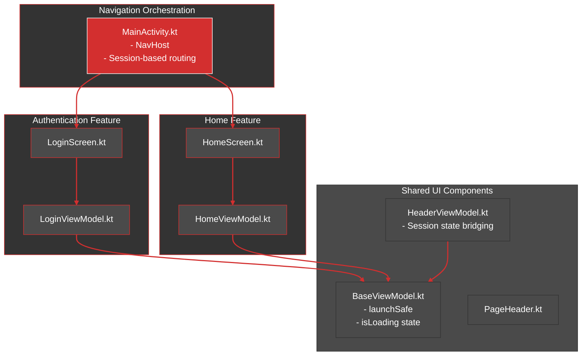

### 3.2 Domain Layer (Business Logic)
**Goal**: House the platform-agnostic business rules and "truth" of the application.
- **Pure Kotlin**: This layer has zero dependencies on the Android Framework (no `Context`, no `Parcelable`).
- **Entities**: Data classes like `User` and `Credentials` represent the core business models.
- **Use Cases (Interactors)**: Each business action is encapsulated in a dedicated Use Case (e.g., `LoginUseCase`). This promotes the Single Responsibility Principle and makes logic reusable across ViewModels.
- **BaseUseCase Pattern**: All interactors inherit from `BaseUseCase<P, R>`. This architectural anchor standardizes:
    - **Thread Safety**: Automatic execution on `Dispatchers.IO`.
    - **Result Wrapping**: Consistent use of the `Result<T>` sealed class for Success/Error states.
    - **Functional Invocation**: Use cases are invoked as functions using the invoke operator.

- **Key Components**:
    - `BaseUseCase<P, R>`: Standardizes execution context (Coroutines) and error handling.
    - `SessionManagerInterface`: Defines the contract for session operations without revealing implementation details.
    - `LoginUseCase`: Encapsulates the authentication transaction. 
    - `LogoutUseCase`: Orchestrates atomic session teardown.

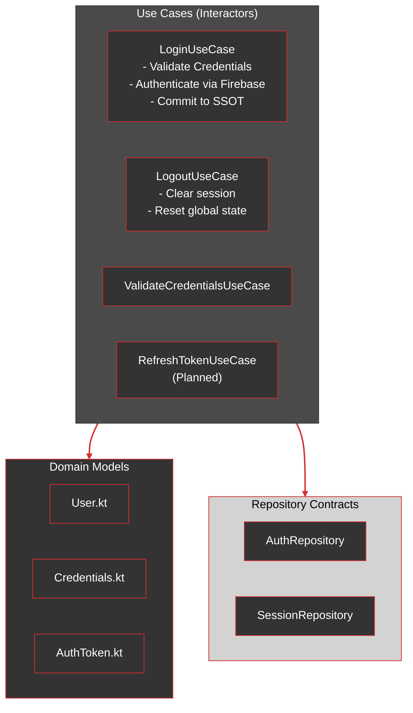

### 3.3 Data Layer (Infrastructure)
**Goal**: Manage data acquisition, persistence, and external service coordination.
- **Repository Pattern**: Acts as a mediator between different data sources (Network, Database) and the Domain Layer.
- **Session Management**: `SessionManager` serves as the Single Source of Truth (SSOT) for the user's authentication state, exposing `StateFlow<AuthState>` for the UI to observe.
- **Production Sources**: Production-grade implementation using Firebase Auth and Jetpack DataStore.
- **Telemetry**: Integrated Firebase Analytics for automated journey tracking.
- **Dependency Inversion**: Repository interfaces defined in Domain; implementations in Data.
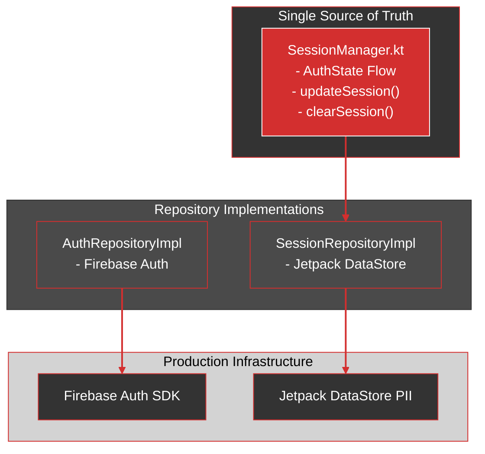
#### Session State Machine

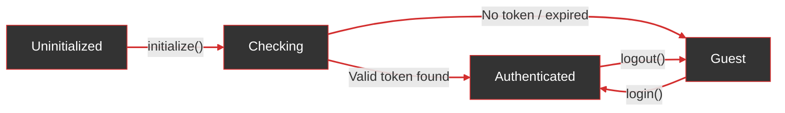
#### Authentication Flow Architecture
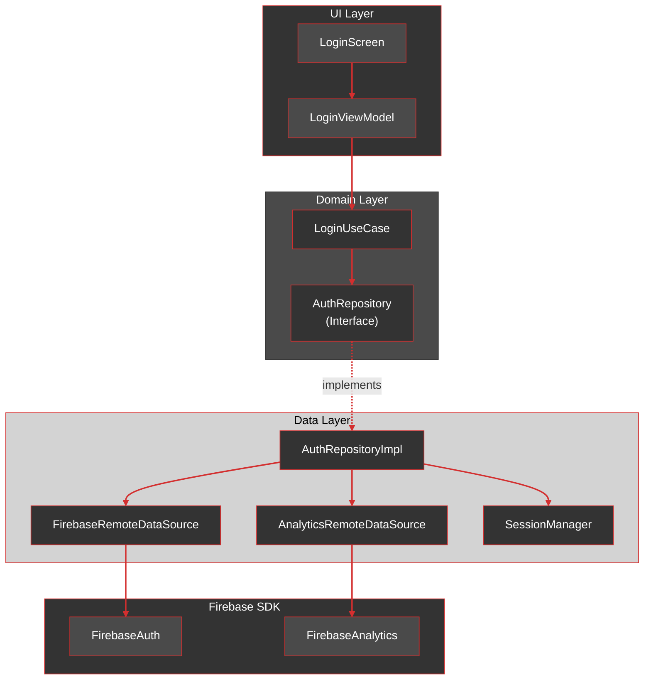
#### Telemetry and Analytics Integration

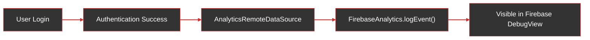

---

## 4. Technical Implementation Standards

Rho Studio UI is engineered for sensitive information (fintech) environments

### 4.1 Session Isolation

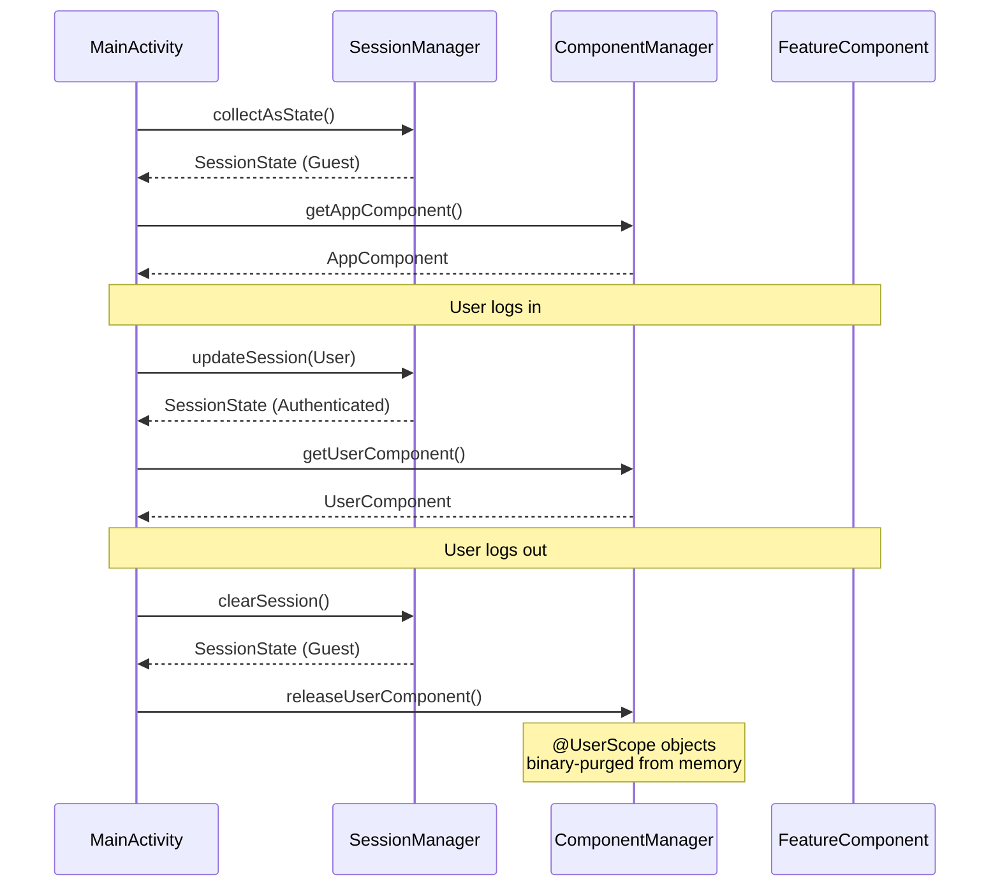

### 4.2 Modularization Strategy
The project is split into granular Gradle modules to improve build times and enforce architectural boundaries:
- `:app`: The main coordinator and DI root.
- `:features:*`: Feature-specific UI and ViewModels (e.g., `:features:auth`, `:features:home`).
- `:core:ui`: Shared design system components and theming.
- `:core:domain`: The platform-agnostic business layer.
- `:core:data`: Implementation details for data and external services.

### 4.3 Design System
Located in `:core:ui`, the design system defines the application's visual language:
- **Typography**: Custom typeface integration.
- **Color Palette**: Strict adherence to the Rho Studio brand (`RhoRed`, `RhoStrongGray`).
- **Components**: A library of reusable, styleable components (Buttons, Inputs, Cards).

---

## 5. Roadmap & Evolution: Strategic Phases

The application is transitioning from a modular prototype to a production-hardened system. The evolution is structured into three strategic phases:

### Phase I: Dependency Orchestration & Decoupling
- **Dagger Migration**: Implementation of **Dagger 2** to replace manual Service Locators.
    - Define `@Component` and `@Module` boundaries for `:core` and `:features`.
    - Implement `@Inject` for UseCase and ViewModel construction to ensure compile-time dependency safety.
- **Interface Segregation**: Strict enforcement of domain-defined interfaces to further isolate the Data Layer from Business Logic.

### Phase II: Transactional Integrity & persistence
- **Advanced Token Management**:
    - Implementation of an atomic token refresh mechanism within the Data Layer.
    - Securing critical transaction flows by validating session integrity before high-stakes domain executions.
    - Complete token lifecycle: Acquisition → Persistence → Validation → Refresh → Recovery → Invalidation.
- **Offline-First with Room**:
    - Integration of **Room Database** as the local cache for service modules.
    - Implementation of a "Source of Truth" strategy in Repositories to handle network-to-local synchronization.
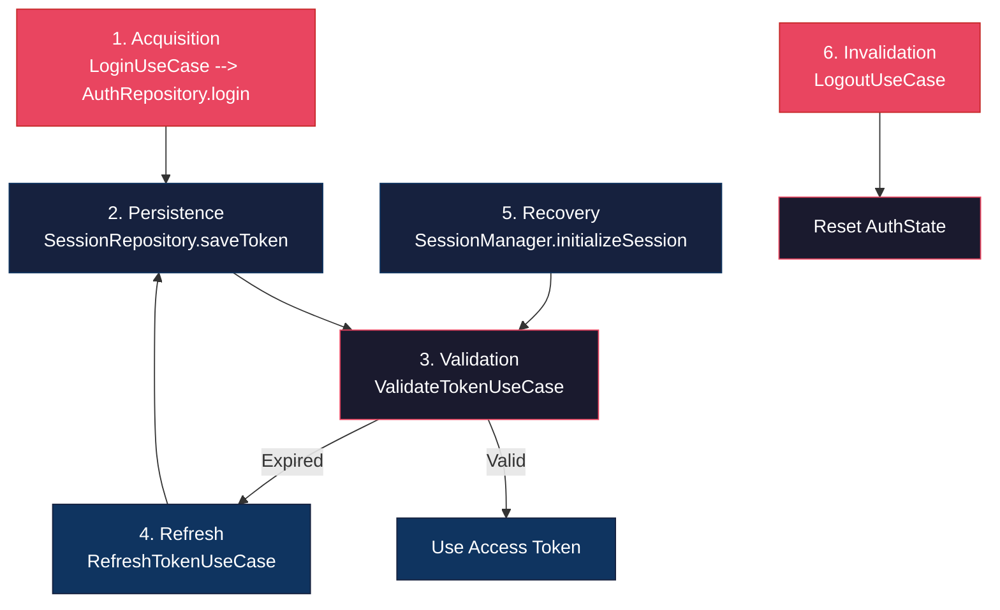

### Phase III: Verification & Quality Engineering
- **Domain Test Suite**: Achieving 90%+ coverage for `:core:domain` logic using JUnit 5 and MockK.
- **UI & Regression Testing**:
    - Implementation of **Compose UI Tests** for critical user journeys (Login, Home navigation).
    - Integration of **Screenshot Testing** to ensure visual consistency across the Rho Studio design system.
- **Performance Profiling**: Regular benchmarking of recomposition counts and memory allocation in high-density feature screens.
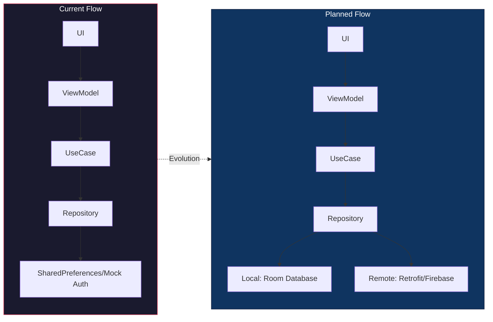
---

## 6. Verification & Quality Assurance
- **CI/CD**: GitHub Actions pipeline verifies every commit against build and test suites.
- **Static Analysis**: Automated linting and ASCII metadata headers enforce code style and legal standards.

## 7. File Registry and responsibilities
Here is the updated table based on the file structure provided:

| File / Module                     | Layer        | Responsibility                       | Status |
|:----------------------------------|:-------------|:-------------------------------------|:-------|
| `MainActivity.kt`                 | UI Layer     | Navigation orchestration             | ✅      |
| `BaseViewModel.kt`                | UI Layer     | Loading/Error state management       | ✅      |
| `HeaderViewModel.kt`              | UI Layer     | Session state bridging               | ✅      |
| `PageHeader.kt` / `PageFooter.kt` | UI Layer     | Shared UI components                 | ✅      |
| `LoginScreen.kt`                  | UI Layer     | Login UI entry point                 | ✅      |
| `LoginViewModel.kt`               | UI Layer     | Form state & validation              | ✅      |
| `LoginEmailField.kt`              | UI Layer     | Email input with validation          | ✅      |
| `LoginPasswordField.kt`           | UI Layer     | Password input with security         | ✅      |
| `LoginButton.kt`                  | UI Layer     | Login action button                  | ✅      |
| `HomeScreen.kt`                   | UI Layer     | Home UI entry point                  | ✅      |
| `HomeViewModel.kt`                | UI Layer     | Home state & session termination     | ✅      |
| `ServiceList.kt`                  | UI Layer     | Service list grid component          | ✅      |
| `ServiceItem.kt`                  | UI Layer     | Individual service item component    | ✅      |
| `ServiceModule.kt`                | UI Layer     | Feature-specific model (Home)        | ✅      |
| `BaseUseCase.kt`                  | Domain Layer | Standardized UseCase abstraction     | ✅      |
| `LoginUseCase.kt`                 | Domain Layer | Atomic authentication transaction    | ✅      |
| `LogoutUseCase.kt`                | Domain Layer | Session teardown orchestration       | ✅      |
| `SessionManagerInterface.kt`      | Domain Layer | Session operations contract          | ✅      |
| `AuthRepository.kt`               | Domain Layer | Authentication contract              | ✅      |
| `SessionRepository.kt`            | Domain Layer | Session persistence contract         | ✅      |
| `User.kt` / `Credentials.kt`      | Domain Layer | Pure Kotlin Entities                 | ✅      |
| `SessionManager.kt`               | Data Layer   | SSOT for authentication              | ✅      |
| `AuthRepositoryImpl.kt`           | Data Layer   | Mock auth (Firebase **planned**)     | ⚠️     |
| `SessionRepositoryImpl.kt`        | Data Layer   | SharedPreferences (Room **planned**) | ⚠️     |
| `RefreshTokenUseCase.kt`          | Domain Layer | Token refresh (**planned**)          | 📅     |
| `Dagger Components`               | App Root     | DI setup (**planned**)               | 📅     |
## 8. References & Standards
- **MAD (Modern Android Development)**: Adhering to official [Android Architecture Guidelines](https://developer.android.com/topic/architecture).
- **Jetpack Compose Best Practices**: Following UDF ([Unidirectional Data Flow](https://developer.android.com/develop/ui/compose/architecture#udf)) principles for state management.
- **Multi-Module Topology**: Following [Guide to App Modularization](https://developer.android.com/topic/modularization).
- **Dependency Injection**: [Dagger Documentation](https://dagger.dev/).
- **Secure Token Management**: [Android Security Best Practices](https://developer.android.com/privacy-and-security/security-best-practices).

---
**[Rho.Studio®](https://rho.studio/) - Engineering Department** - Contact [alexis.tercero@rho.studio](mailto:alexis.tercero@rho.studio)
